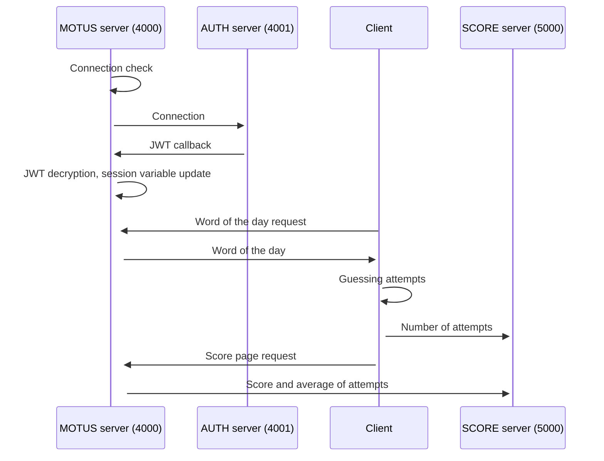

# CY Tech | ING3 IA1 | Micro-services | SUTOM Project

**Authors**
Thomas Danguilhen
Céline Goncalves
Emil Răducanu
Arthur Sarmini Det Satouf

## 1. To launch the application

**Clone the [project](https://github.com/Danguilhen/Ing3_Microservice_SUTOM.git)**

```bash
git clone https://github.com/Danguilhen/Ing3_Microservice_SUTOM.git
```

**Run the application**

```bash
sudo sh run.sh
```

**That's it! Go to your localhost on any web browser**

```bash
localhost:4000
```

## 2. Technical description

**Purpose of the application**This app allows a user to play the game of SUTOM by submitting a sequence of letters in order to find a specific word. If the submitted letters appear:

- Green: the submitted letter corresponds to the letter of the word that has to be find.
- Orange: the submittted letter is in the word that has to be find, but not at the right position.
- Red: the submitted letter is not in the word that has to be find.

The user can submit as much letter sequences as she/he wants untill he/she wins.
**Additional features**

- **Log with OpenID** The user can log into her/his account with a username and a password. A new account is created if he/she is not registered yet. The authentification is made with a JSON Web Token.
- **Score** Once logged in, the user can access to her/his current score and the average of attempts each days.
- **A unique word per day**The word that has to be find changes each day thanks to a seed based on the date. Once guessed by the user, he/she cannot play until next day.
- **Monitoring**The application can be monitored with the [Grafana](https://grafana.com/) (Loki, Prometheus). It is accessible via `localhost:3000`.

**Docker containers**

- Server `index` on port 4000
- Server `score` on port 5000
- Server `auth` on port 4001

**APIs used**

- `app.use('/score')` needs the username
- `app.use('/newuser')` needs username and password
- `app.post('/print_score')` needs username
- `app.get('/mot')`

**Sequence diagram implemented with [Mermaid](https://mermaid.live/)**
_Simple use case of a user logging in and playing. The score and the average winning time is updated._



**Improvement tracks**

- **DB** Use a proper database instead of a flat file (currently using a `.txt` file).
- **Reverse proxy** Use a reverse-proxy to better manage multiple clients.
- **Security** Ensure that the servers communicate between them and not always with the client. The client should communicate with only one server (e.g. `index`).
- **Front end**
  Improve the HTML and CSS code for a better page layout.
